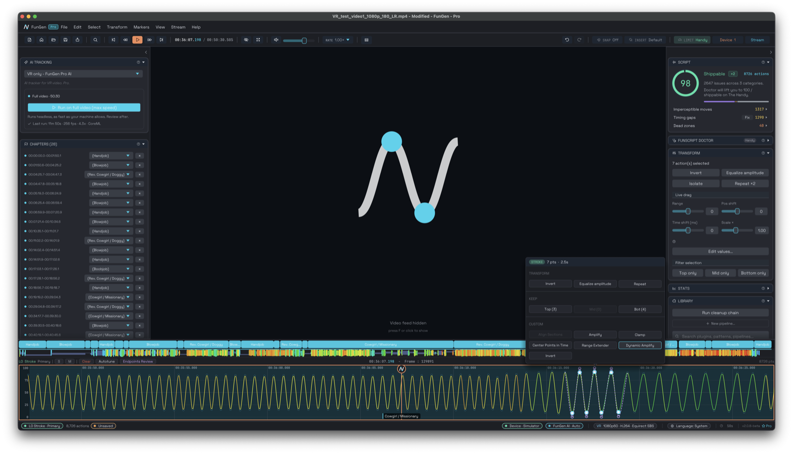

# FunGen

**The all-in-one funscript editor, generator, and player.** Turn video into funscripts, edit them frame-accurately, and play them straight to your device. Free tracking algorithms, with a Pro Pass to unlock the next level of AI generation right on your computer.

> *Enjoy your time.*

🌐 **[Website](https://ack00gar.github.io/fungen-site/)** · 📥 **[Download](https://github.com/ack00gar/FunGen/releases)** · 💬 **[Discord](https://discord.com/invite/WYkjMbtCZA)**

FunGen is a complete, cross-platform funscript editor and AI generator. A single native binary per platform: no Python runtime, no shell scripts, no mismatched libraries to chase. Just download one file and run.

Generate, edit, refine. Or just generate and play. Or even, just play.

## The editor

- **Timeline.** Frame-accurate point editing, rich selection (peaks/valleys, top/middle/bottom, by-chapter, left/right of the playhead), transforms (equalize, isolate, ripple-delete, repeat-stroke, snap-to-playhead magnet, and more), parametric stroke generation, all with live preview. Plus a plugin / macro system for repeatable edits.
- **Multi-axis.** Full multi-axis scripting (stroke, surge, sway, twist, roll, pitch). Open several scripts or axes as lanes side by side and ghost one over another to compare and reference while you edit.
- **Funscript Doctor.** Scores your script's quality, flags issues (speed limits, gaps, missing strokes…) and offers one-click auto-fixes.
- **Chapters, bookmarks & heatmap.** A chapter bar with custom types, bookmarks, and a colored heatmap.
- **Unlimited undo/redo.** With a visual history browser that survives closing and reopening a project.

## AI generation

Try it free, never forced to buy. Turn raw video into a draftable funscript in one pass, then refine by hand. Several ways in:

- **FunGenerate.** Proposes the next 20 seconds of motion from the playhead, shown as a live ghost over your script; accept or reject before it commits. Judge the AI's quality on your own content before deciding anything.
- **Full auto-generation.** Run the AI tracking pipeline over the whole video.
- **Live recording.** Drive the motion yourself (mouse or controller) while it plays, and record it live.
- **Quick-generate from Welcome.** Drop a video in and go.

Two tiers, no lock-out:

- **Free.** Base algorithmic generation for everyone, plus the AI generation itself behind a short metered wait. You can genuinely try it.
- **Pro.** Removes the wait and unlocks the dedicated high-quality 2D and VR AI models. See [pricing](https://ack00gar.github.io/fungen-site/#pricing).

## Playback & devices

- **Built-in player.** Hardware-accelerated decoding; scrub and preview without a separate player.
- **Device output.** Drives single- and multi-axis hardware over Buttplug, T-Code and Handy, with an on-screen position gauge.

## Cross-platform, properly

One native binary per platform (Windows / macOS / Linux), localized in multiple languages. It is under active development and in beta. Feedback from the community directly shapes it, so bug reports and feature requests are very welcome.

## Downloads

Get the latest build for macOS, Windows, or Linux from the [Releases](https://github.com/ack00gar/FunGen/releases) page.

## Community

Join the [Discord community](https://discord.com/invite/WYkjMbtCZA) for discussions, support, and updates.

## Support

If FunGen is useful to you, you can support its development on [Patreon](https://patreon.com/FunGen_AI) or [PayPal](https://paypal.me/k00gar).

## License

FunGen is free for personal, non-commercial use only. See [LICENSE](LICENSE) for the full terms.

For commercial or business use, please get in touch: fungen_ai@proton.me
